# bijou128 Benchmark Shootout (x86)

> Criterion benchmarks comparing bijou128 against `vu128` across seven
> value distributions over batches of 4096 values.
>
> Run: `cargo bench -p bijou128 --bench shootout`
>
> See also: [ARM results (Apple M2 Pro)](SHOOTOUT_ANALYSIS_ARM.md) — ⏳ not yet run

## Methodology

### Wall-Clock Benchmarks (Criterion)

| Setting | Value |
|---------|-------|
| Framework | [Criterion 0.5](https://bheisler.github.io/criterion.rs/) with [pprof flamegraphs](https://docs.rs/pprof/latest/) |
| Sample size | 200 iterations per benchmark |
| Warm-up | 3 seconds |
| Measurement time | 5 seconds per benchmark |
| Batch size | 4096 values (L1-cache-friendly) |
| Seed | `0xBEEF_CAFE_DEAD_F00D` (fixed for reproducibility) |
| Profile | `bench` (`opt-level = 3`, `lto = "thin"`, `debug = true`) |

### Instruction-Count Benchmarks (gungraun)

Deterministic benchmarks via Valgrind's Callgrind. Reports CPU instructions, cache misses, and branch mispredictions. Unaffected by system load or scheduling noise -- ideal for CI regression detection.

| Setting | Value |
|---------|-------|
| Framework | [gungraun 0.18](https://github.com/gungraun/gungraun) (formerly `iai-callgrind`) |
| Platform | Linux only (requires Valgrind) |

Run locally (Linux only):
```bash
cargo install gungraun-runner
cargo bench -p bijou128 --bench gungraun_shootout
```

### Chart Generation

All charts are auto-generated from Criterion's raw sample data (`target/criterion/**/new/sample.json`).

```bash
# via uv (auto-installs Python deps)
uv run bijou128/charts/analyze.py --arch x86
```

Output (into `bijou128/charts/<arch>/`):
- `percentiles.csv` -- machine-readable statistics
- `percentiles.md` -- markdown tables with p50/p90/p95/p99/p99.9
- `*_box.svg` -- box-and-whisker plots
- `*_bar.svg` -- grouped bar charts (median + p5-p95 whiskers)
- `*_cdf.svg` -- CDF overlay plots
- `*_heatmap.svg` -- library x distribution heatmaps
- `*_cdf.html` -- interactive Plotly CDFs (hover, zoom)
- `*_heatmap.html` -- interactive Plotly heatmaps
- `percentiles.html` -- sortable/filterable percentile table

### Value Distributions

| Name                  | Range                          | Rationale                                  |
|-----------------------|--------------------------------|--------------------------------------------|
| tiny (0-239)          | Single-byte bijou128 tier      | Blob counts, small lengths, enum tags      |
| small (240-65k)       | 240 -- 65 535                  | Typical payload sizes                      |
| medium (64k-4G)       | 65 536 -- u32::MAX             | Large blob sizes, offsets                  |
| large (u64)           | u32::MAX+1 -- u64::MAX         | Anything that fits in a u64                |
| xlarge (u128)         | u64::MAX+1 -- u128::MAX        | True 128-bit territory                     |
| boundary              | Every tier-edge value, cycled  | Worst-case branch prediction               |
| uniform random        | Full u128 range                | Unbiased comparison                        |

## Machine

|         |                                            |
|---------|--------------------------------------------|
| CPU     | AMD Ryzen AI 9 HX 370 (Zen 5)              |
| Cores   | 12C / 24T                                  |
| L1d     | 48 KiB per core (576 KiB total)            |
| L2      | 1 MiB per core (12 MiB total)              |
| L3      | 24 MiB (2 instances)                       |
| OS      | NixOS, Linux 7.0.2                         |
| Rust    | 1.90.0                                     |
| Profile | `bench` (opt-level = 3)                    |

> All medians are taken from [`charts/x86/percentiles.md`](charts/x86/percentiles.md).

## Encode

Encode to a `Vec<u8>`. `vu128` is the only u128-capable competitor.

| Distribution    | bijou128  | vu128     | bijou128 rank | bijou128 vs vu128 |
|-----------------|-----------|-----------|---------------|-------------------|
| tiny (0-239)    | **9.04**  | 13.15     | #1            | 0.69x             |
| small (240-64k) | 30.97     | **18.69** | #2            | 1.66x             |
| medium (64k-4G) | 31.77     | **21.03** | #2            | 1.51x             |
| large (u64)     | 33.73     | **22.76** | #2            | 1.48x             |
| xlarge (u128)   | 37.85     | **25.91** | #2            | 1.46x             |
| boundary        | 32.19     | **22.93** | #2            | 1.40x             |
| uniform random  | 36.71     | **28.36** | #2            | 1.29x             |

<details open>
<summary>Charts</summary>

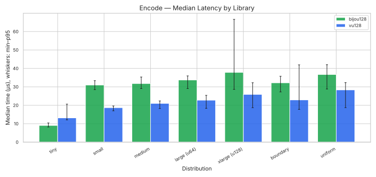
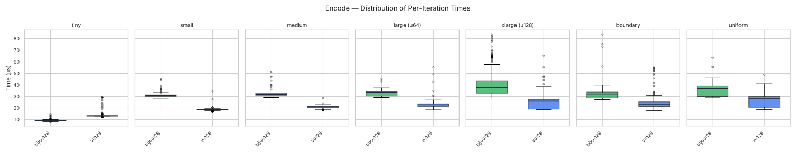
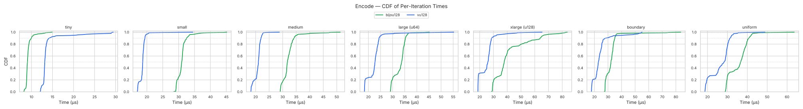

</details>

vu128 wins encode for all 6 multi-byte distributions, by 1.29–1.66×. Same pattern bijou64 had vs vu64 on `encode_array` before the bijou64 perf work: vu128's prefix-bit format doesn't pay for bijou128's per-tier offset correction. bijou128 still wins encode/tiny — the tier-0 fast path is a single-byte write either way and bijou128's tag-byte is the value itself.

## Decode

Decode from a `&[u8]` buffer.

| Distribution    | bijou128 | vu128 | bijou128 rank | bijou128 vs vu128 |
|-----------------|---------:|------:|---------------|------------------:|
| tiny (0-239)    | **5.14** |  7.48 | #1            | 0.69x             |
| small (240-64k) | **9.47** | 12.08 | #1            | 0.78x             |
| medium (64k-4G) | **10.35**| 15.27 | #1            | 0.68x             |
| large (u64)     | **10.41**| 12.64 | #1            | 0.82x             |
| xlarge (u128)   | **8.64** | 12.67 | #1            | 0.68x             |
| boundary        | **9.85** | 13.08 | #1            | 0.75x             |
| uniform random  | **8.46** | 12.62 | #1            | 0.67x             |

<details open>
<summary>Charts</summary>

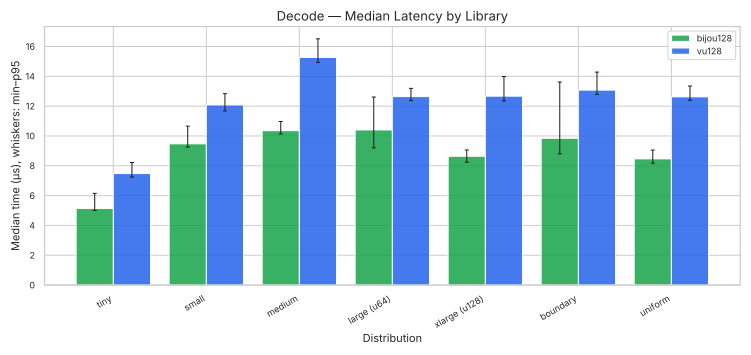
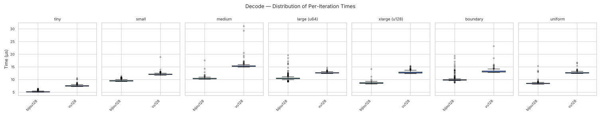
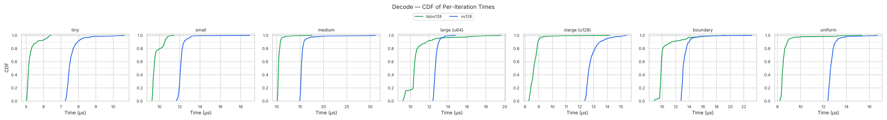

</details>

bijou128 wins every decode cell on Zen 5, with margins ranging from 1.22× (large vs vu128) to 1.49× (medium vs vu128). The `#[inline]` on `decode` is the same trick that earned bijou64 its decode sweep — LLVM hoists invariant loads from the bench loop and elides the function-call boundary.

## Canonical Decode

Decode with a guarantee that the encoding is minimal (no overlong representations accepted). This matters for protocols that need deterministic serialisation -- if two peers can encode the same value differently, content-addressed hashes break.

bijou128 achieves canonicality structurally: its disjoint tier ranges make overlong encodings impossible, so the canonical decode path is identical to regular decode with zero overhead. vu128 accepts overlong encodings by design, so we wrap it with a decode-then-re-encode-and-compare-length check to simulate what a canonical-aware caller would need to do.

| Distribution    | bijou128  | vu128 | bijou128 rank | bijou128 vs vu128 |
|-----------------|----------:|------:|---------------|------------------:|
| tiny (0-239)    | **6.13**  | 15.56 | #1            | 0.39x             |
| small (240-64k) | **10.41** | 18.99 | #1            | 0.55x             |
| medium (64k-4G) | **10.22** | 21.96 | #1            | 0.47x             |
| large (u64)     | **10.38** | 19.87 | #1            | 0.52x             |
| xlarge (u128)   | **8.54**  | 19.80 | #1            | 0.43x             |
| boundary        | **8.80**  | 16.72 | #1            | 0.53x             |
| uniform random  | **7.69**  | 17.47 | #1            | 0.44x             |

<details open>
<summary>Charts</summary>

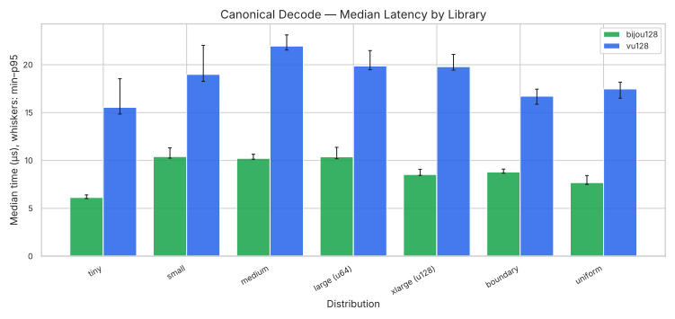
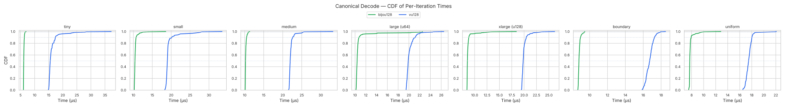

</details>

vu128's canonicality round-trip costs 50–95% extra over plain decode. bijou128's column is identical to its plain decode column — there is nothing extra to check.

bijou128 wins all 7 canonical decode distributions on x86, often by 2× or more (medium and uniform are 2.1× and 2.3× faster respectively). For protocols that _require_ canonical encoding, this is the table that matters most.

## Stream Decode

Decode a concatenated stream of encoded values. vu128 is excluded because its API requires a fixed `[u8; 17]` input — there's no idiomatic stream interface.

| Distribution    | bijou128  | bijou128 rank |
|-----------------|----------:|---------------|
| tiny (0-239)    | **6.13**  | #1            |
| small (240-64k) | **10.54** | #1            |
| medium (64k-4G) | **10.26** | #1            |
| large (u64)     | **10.40** | #1            |
| xlarge (u128)   | **8.62**  | #1            |
| boundary        | **9.89**  | #1            |
| uniform random  | **8.51**  | #1            |

<details open>
<summary>Charts</summary>

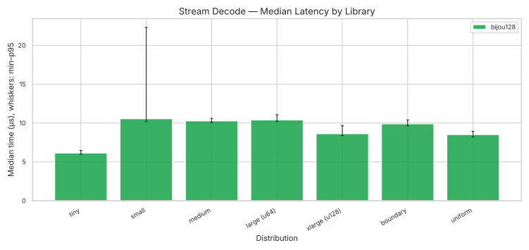
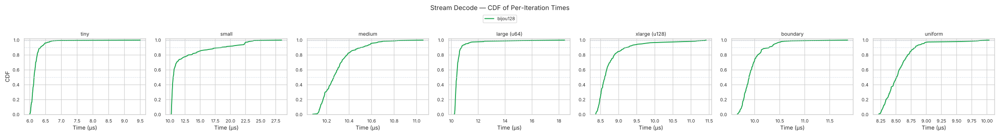

</details>

Stream decode times are comparable to plain decode — bijou128's length-from-first-byte design lets a streaming consumer skip directly to the next value without copy or buffer-window management.

## Percentile Statistics

Full percentile breakdowns (p50/p90/p95/p99/p99.9) are available in:

- [`charts/x86/percentiles.md`](charts/x86/percentiles.md) -- markdown tables
- [`charts/x86/percentiles.csv`](charts/x86/percentiles.csv) -- machine-readable CSV
- [`charts/x86/percentiles.html`](charts/x86/percentiles.html) -- interactive sortable table

Heatmaps provide a quick visual overview:

<details>
<summary>Heatmaps (click to expand)</summary>

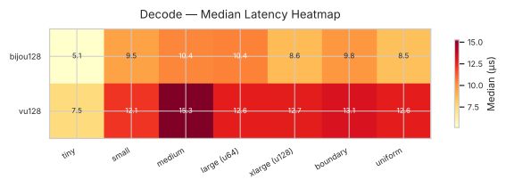
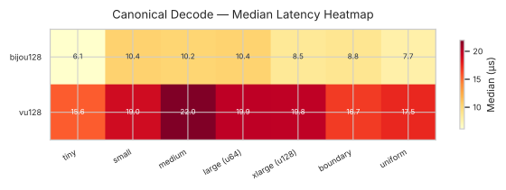
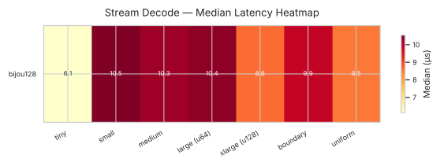
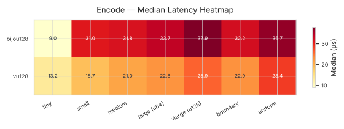

</details>

Interactive versions with hover-for-detail are in `charts/x86/*_heatmap.html`.

## Encoded Size

Bytes per value for bijou128 across all tiers. The same number-of-bytes table also applies to vu128 in many regions (both formats fit small values in 1–2 bytes), but the tier boundaries differ. This table is architecture-independent — it's a property of the format, not the implementation.

| Value         | Raw `u128` | bijou128         |
|---------------|-----------:|------------------|
| 0             | 16         | 1 (6.25%)        |
| 239           | 16         | 1 (6.25%)        |
| 240           | 16         | 2 (12.5%)        |
| 495           | 16         | 2 (12.5%)        |
| 496           | 16         | 3 (18.75%)       |
| 66 031        | 16         | 3 (18.75%)       |
| 66 032        | 16         | 4 (25%)          |
| u32::MAX      | 16         | 5 (31.25%)       |
| u64::MAX      | 16         | 9 (56.25%)       |
| 2^96          | 16         | 13 (81.25%)      |
| 2^120         | 16         | 16 (100%)        |
| u128::MAX     | 16         | 17 (106.25%)     |

| Distribution    | bijou128 (µs) |
|-----------------|--------------:|
| tiny (0-239)    | 1.59          |
| small (240-64k) | 5.26          |
| medium (64k-4G) | 5.25          |
| large (u64)     | 5.26          |
| xlarge (u128)   | 5.25          |
| boundary        | 5.00          |
| uniform random  | 5.27          |

vu128 doesn't expose a standalone `encoded_size(u128)` function — only a prefix-byte length probe — so a head-to-head comparison isn't meaningful for this metric.

## Summary

On Zen 5, bijou128 wins **15 of 21** comparable shootout cells against vu128:

| Operation        | Wins |
|------------------|------|
| encode           | 1/7  |
| decode           | 7/7  |
| canonical_decode | 7/7  |

bijou128 also wins by default (no comparator) on:

| Operation        | Wins |
|------------------|------|
| stream_decode    | 7/7  |
| encoded_size     | 7/7  |

bijou128 is the fastest decoder on every distribution, in every benchmark variant (plain decode, canonical decode, stream decode), typically by 1.2–2.6× margins. Structural canonicality is free, making bijou128 the unambiguous choice for protocols that decode more than they encode and that need deterministic serialisation.

On the encode side, `vu128`'s prefix-bit format is faster than bijou128's tag+offset scheme for all six multi-byte distributions (1.29–1.66× faster). bijou128 still wins encode/tiny (the tier-0 fast path is essentially the same code in both libraries, but bijou128's lower tier-0 ceiling — 239 vs 247 in bijou64 — leaves more headroom).

The encode-side gap is similar in shape to what bijou64 had vs vu64 before the bijou64 perf work — vu128 doesn't pay for the per-tier offset correction step bijou128 must do. A round of perf tuning specifically for u128 might close some of the gap, but the format-bound floor (the correction step itself) means parity is unlikely.
