# bijou64 Benchmark Shootout (ARM)

> Criterion benchmarks comparing bijou64 against varu64, vu64, vu128, and leb128 across six value distributions over batches of 4096 values.
>
> Run: `cargo bench -p bijou64 --bench shootout`
>
> See also: [x86 results (AMD Ryzen AI 9 HX 370 / Zen 5)](SHOOTOUT_ANALYSIS_X86.md)

## Methodology

### Wall-Clock Benchmarks (Criterion)

| Setting | Value |
|---------|-------|
| Framework | [Criterion 0.5](https://bheisler.github.io/criterion.rs/) with [pprof flamegraphs](https://docs.rs/pprof/latest/) |
| Sample size | 200 iterations per benchmark |
| Warm-up | 3 seconds |
| Measurement time | 5 seconds per benchmark |
| Batch size | 4096 values (L1-cache-friendly) |
| Seed | `0xBEEF_CAFE_DEAD_F00D` (fixed for reproducibility) |
| Profile | `bench` (`opt-level = 3`, `lto = "thin"`, `debug = true`) |

### Instruction-Count Benchmarks (gungraun)

Deterministic benchmarks via Valgrind's Callgrind. Reports CPU instructions, cache misses, and branch mispredictions. Unaffected by system load or scheduling noise -- ideal for CI regression detection.

| Setting | Value |
|---------|-------|
| Framework | [gungraun 0.18](https://github.com/gungraun/gungraun) (formerly `iai-callgrind`) |
| Platform | Linux only (requires Valgrind) |
| CI | `.github/workflows/gungraun-bench.yml` |

Run locally (Linux only):
```bash
cargo install gungraun-runner
cargo bench -p bijou64 --bench gungraun_shootout
```

### Chart Generation

All charts are auto-generated from Criterion's raw sample data (`target/criterion/**/new/sample.json`).

```bash
# via nix flake app
nix run .#bench-charts

# or via uv (auto-installs Python deps)
uv run bijou64/charts/analyze.py --arch arm
```

Output (into `bijou64/charts/<arch>/`):
- `bijou64/charts/<arch>/percentiles.csv` -- machine-readable statistics
- `bijou64/charts/<arch>/percentiles.md` -- markdown tables with p50/p90/p95/p99/p99.9
- `bijou64/charts/<arch>/*_box.svg` -- box-and-whisker plots
- `bijou64/charts/<arch>/*_bar.svg` -- grouped bar charts (median + p5-p95 whiskers)
- `bijou64/charts/<arch>/*_cdf.svg` -- CDF overlay plots
- `bijou64/charts/<arch>/*_heatmap.svg` -- library x distribution heatmaps
- `bijou64/charts/<arch>/*_cdf.html` -- interactive Plotly CDFs (hover, zoom)
- `bijou64/charts/<arch>/*_heatmap.html` -- interactive Plotly heatmaps
- `bijou64/charts/<arch>/percentiles.html` -- sortable/filterable percentile table

### Value Distributions

| Name | Range | Rationale |
|------|-------|-----------|
| tiny (0-247) | Single-byte bijou64 tier | Blob counts, small lengths, enum tags |
| small (248-64k) | 248 -- 65,535 | Typical payload sizes |
| medium (64k-4B) | 65,536 -- 4,294,967,295 | Large blob sizes, offsets |
| large (>4B) | > 2^32 | Content hashes as integers, counters |
| boundary | All 18 tier-edge values, cycled | Worst-case branch prediction |
| uniform random | Full u64 range | Unbiased comparison |

## Machine

|         |                         |
|---------|-------------------------|
| CPU     | Apple M2 Pro            |
| Memory  | 32 GB                   |
| OS      | macOS 26.3.1            |
| Rust    | 1.94.0                  |
| Profile | `bench` (opt-level = 3) |

> All medians are taken from [`charts/arm/percentiles.md`](charts/arm/percentiles.md).

## Encode

Encode to a `Vec<u8>`.

| Distribution    | bijou64      | varu64 | vu64         | vu128 | leb128       | bijou64 rank | bijou64 vs other best |
|-----------------|--------------|--------|--------------|-------|--------------|--------------|----------------------|
| tiny (0-247)    | **2.16** | 10.89  | 20.72        | 16.55 | 3.62         | #1           | 0.60x                |
| small (248-64k) | 8.54         | 20.53  | 22.42        | 19.59 | **7.46** | #2           | 1.14x                |
| medium (64k-4B) | **8.94** | 25.61  | 21.75        | 21.08 | 12.13        | #1           | 0.74x                |
| large (>4B)     | **9.25** | 27.19  | 10.48        | 11.30 | 30.48        | #1           | 0.88x                |
| boundary        | **8.03** | 28.63  | 17.85        | 17.83 | 10.76        | #1           | 0.75x                |
| uniform random  | **9.07** | 29.04  | 10.94        | 11.95 | 32.50        | #1           | 0.83x                |

<details open>
<summary>Charts</summary>

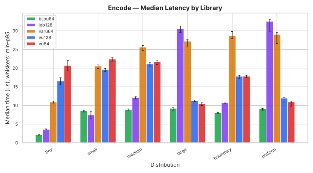
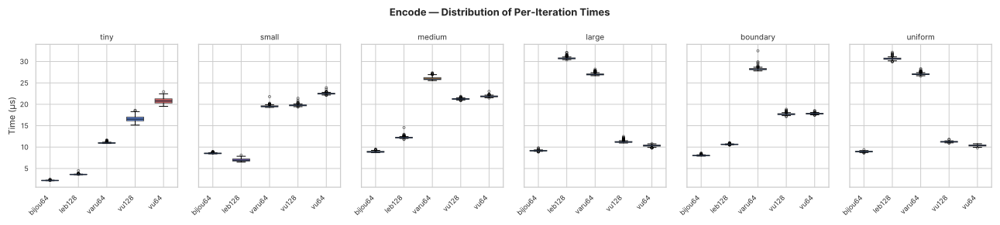
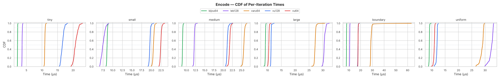

</details>

bijou64 wins 5 of 6 encode distributions on M2 Pro. The sole loss is `small` to leb128 (1.14x behind), where leb128's tight 2-byte write loop fits well. The encode improvements from the shift+truncate trick are even more pronounced on ARM than on Zen 5 -- medium and boundary distributions that previously lost are now clear wins.

## Decode

Decode from a `&[u8]` buffer.

| Distribution    | bijou64      | varu64 | vu64  | vu128 | leb128 | bijou64 rank | bijou64 vs other best |
|-----------------|--------------|--------|-------|-------|--------|--------------|----------------------|
| tiny (0-247)    | **2.62** | 5.27   | 15.66 | 22.42 | 6.65   | #1           | 0.50x                |
| small (248-64k) | **6.09** | 10.53  | 13.21 | 14.71 | 14.36  | #1           | 0.58x                |
| medium (64k-4B) | **6.09** | 17.24  | 15.26 | 11.30 | 17.23  | #1           | 0.54x                |
| large (>4B)     | **6.78** | 23.76  | 9.42  | 9.28  | 38.86  | #1           | 0.73x                |
| boundary        | **7.40** | 20.19  | 12.08 | 10.88 | 15.43  | #1           | 0.68x                |
| uniform random  | **6.69** | 23.82  | 9.34  | 9.27  | 37.81  | #1           | 0.72x                |

<details open>
<summary>Charts</summary>

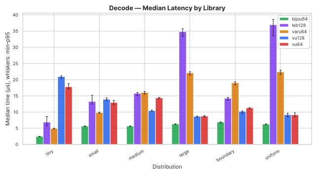
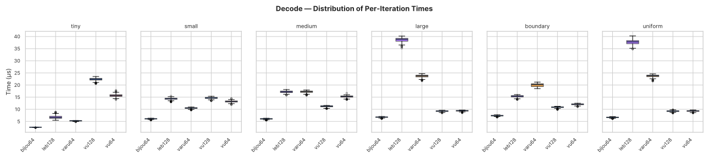
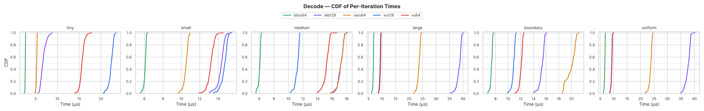

</details>

bijou64 wins every decode cell on M2 Pro, with margins ranging from 1.4x (large vs vu128) to 5.7x (uniform vs leb128). The `#[inline]` on `decode` is the key enabler -- previously, bijou64 lost large, boundary, and uniform to vu64/vu128 on this machine.

## Canonical Decode

Decode with a guarantee that the encoding is minimal (no overlong representations accepted). This matters for protocols that need deterministic serialisation -- if two peers can encode the same value differently, content-addressed hashes break.

bijou64 achieves canonicality structurally: its disjoint tier ranges make overlong encodings impossible, so the canonical decode path is identical to regular decode with zero overhead. varu64 and vu64 always perform a runtime minimality check (there's no way to opt out). vu128 and leb128 accept overlong encodings by design, so we wrap them with a decode-then-re-encode-and-compare-length check to simulate what a canonical-aware caller would need to do.

| Distribution    | bijou64      | varu64 | vu64  | vu128 | leb128 | bijou64 rank | bijou64 vs other best |
|-----------------|--------------|--------|-------|-------|--------|--------------|----------------------|
| tiny (0-247)    | **2.46** | 4.96   | 17.97 | 21.69 | 15.95  | #1           | 0.50x                |
| small (248-64k) | **5.69** | 9.90   | 12.92 | 19.90 | 23.30  | #1           | 0.57x                |
| medium (64k-4B) | **5.69** | 16.18  | 14.42 | 14.56 | 28.08  | #1           | 0.39x                |
| large (>4B)     | **6.32** | 22.24  | 8.79  | 13.59 | 55.17  | #1           | 0.72x                |
| boundary        | **7.46** | 19.06  | 11.24 | 15.74 | 26.82  | #1           | 0.66x                |
| uniform random  | **6.27** | 22.23  | 8.75  | 13.59 | 54.60  | #1           | 0.72x                |

<details open>
<summary>Charts</summary>

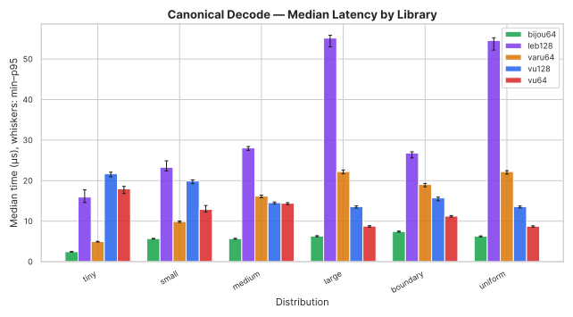
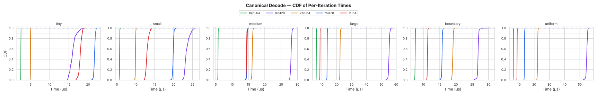

</details>

The cost of canonicality varies wildly by crate. bijou64's numbers are identical to plain decode because there's nothing extra to check. varu64 always pays its runtime check, so its column matches the plain decode table. vu128 and leb128 pay the round-trip re-encode penalty -- leb128 in particular is catastrophic on large/uniform (55 us vs 39 us without the check) because of its byte-at-a-time `Write`/`Read` interface.

bijou64 wins all 6 canonical decode distributions on M2 Pro. For protocols that _require_ canonical encoding, this is the table that matters.

## Stream Decode

Decode a concatenated stream of encoded values. vu128 is excluded because its API requires a fixed `[u8; 9]` input.

| Distribution    | bijou64      | varu64 | vu64  | leb128 | bijou64 rank | bijou64 vs other best |
|-----------------|--------------|--------|-------|--------|--------------|----------------------|
| tiny (0-247)    | **1.82** | 10.97  | 16.58 | 5.85   | #1           | 0.31x                |
| small (248-64k) | **4.95** | 30.29  | 16.67 | 12.59  | #1           | 0.39x                |
| medium (64k-4B) | **4.82** | 16.09  | 14.19 | 15.59  | #1           | 0.34x                |
| large (>4B)     | **5.65** | 24.35  | 8.76  | 34.87  | #1           | 0.64x                |
| boundary        | **6.26** | 22.11  | 14.13 | 14.34  | #1           | 0.44x                |
| uniform random  | **5.58** | 23.85  | 10.70 | 34.47  | #1           | 0.52x                |

<details open>
<summary>Charts</summary>

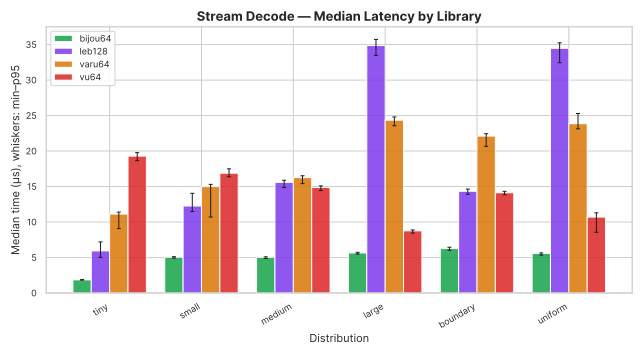
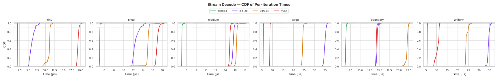

</details>

bijou64 wins every stream_decode cell. The tiny distribution is particularly striking: 1.82 us vs 5.85 us for the next-best (leb128), a 3.2x margin.

## Percentile Statistics

Full percentile breakdowns (p50/p90/p95/p99/p99.9) are available in:

- [`charts/arm/percentiles.md`](charts/arm/percentiles.md) -- markdown tables
- [`charts/arm/percentiles.csv`](charts/arm/percentiles.csv) -- machine-readable CSV
- [`charts/arm/percentiles.html`](charts/arm/percentiles.html) -- interactive sortable table

Heatmaps provide a quick visual overview of which library performs best across all distributions:

<details>
<summary>Heatmaps (click to expand)</summary>

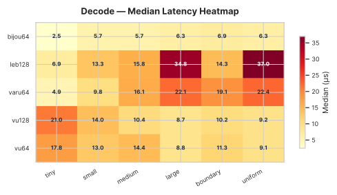
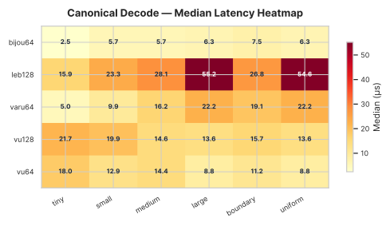
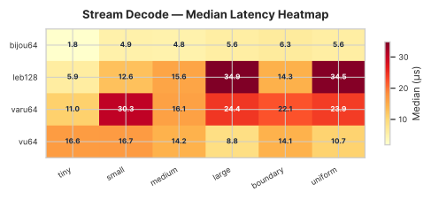
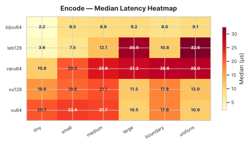

</details>

Interactive versions with hover-for-detail are in `charts/arm/*_heatmap.html`.

## Encoded Size

Bytes per value compared to a raw 8-byte `u64`. All tag-byte formats (bijou64, varu64, vu64/vu128) add 1 byte of overhead for multi-byte values. leb128 uses 1 continuation bit per byte instead.

bijou64 and varu64 share the same tag threshold (248), so their 1-byte range is wider than vu64/vu128 (0-247 vs 0-127). bijou64's per-tier offsets shift the multi-byte boundaries slightly, but the encoded sizes end up identical to varu64 at every value.

| Value    | Raw `u64` | bijou64          | varu64           | vu64 / vu128     | leb128           |
|----------|-----------|------------------|------------------|------------------|------------------|
| 0        | 8         | 1 (12.5%)        | 1 (12.5%)        | 1 (12.5%)        | 1 (12.5%)        |
| 127      | 8         | 1 (12.5%)        | 1 (12.5%)        | 1 (12.5%)        | 1 (12.5%)        |
| 128      | 8         | **1 (12.5%)** | **1 (12.5%)** | 2 (25%)          | 2 (25%)          |
| 247      | 8         | **1 (12.5%)** | **1 (12.5%)** | 2 (25%)          | 2 (25%)          |
| 248      | 8         | 2 (25%)          | 2 (25%)          | 2 (25%)          | 2 (25%)          |
| 255      | 8         | 2 (25%)          | 2 (25%)          | 2 (25%)          | 2 (25%)          |
| 256      | 8         | **2 (25%)**   | 3 (37.5%)        | **2 (25%)**   | **2 (25%)**   |
| 503      | 8         | **2 (25%)**   | 3 (37.5%)        | **2 (25%)**   | **2 (25%)**   |
| 504      | 8         | 3 (37.5%)        | 3 (37.5%)        | **2 (25%)**   | **2 (25%)**   |
| 1,000    | 8         | 3 (37.5%)        | 3 (37.5%)        | **2 (25%)**   | **2 (25%)**   |
| 16,383   | 8         | 3 (37.5%)        | 3 (37.5%)        | **2 (25%)**   | **2 (25%)**   |
| 16,384   | 8         | 3 (37.5%)        | 3 (37.5%)        | 3 (37.5%)        | 3 (37.5%)        |
| 65,535   | 8         | 3 (37.5%)        | 3 (37.5%)        | 3 (37.5%)        | 3 (37.5%)        |
| 65,536   | 8         | **3 (37.5%)** | 4 (50%)          | **3 (37.5%)** | **3 (37.5%)** |
| 66,039   | 8         | **3 (37.5%)** | 4 (50%)          | **3 (37.5%)** | **3 (37.5%)** |
| 100,000  | 8         | 4 (50%)          | 4 (50%)          | **3 (37.5%)** | **3 (37.5%)** |
| 2^24 - 1 | 8         | 4 (50%)          | 4 (50%)          | 4 (50%)          | 4 (50%)          |
| 2^32 - 1 | 8         | 5 (62.5%)        | 5 (62.5%)        | 5 (62.5%)        | 5 (62.5%)        |
| 2^40 - 1 | 8         | 6 (75%)          | 6 (75%)          | 6 (75%)          | 6 (75%)          |
| 2^48 - 1 | 8         | 7 (87.5%)        | 7 (87.5%)        | 7 (87.5%)        | 7 (87.5%)        |
| 2^56 - 1 | 8         | 8 (100%)         | 8 (100%)         | 8 (100%)         | 8 (100%)         |
| 2^64 - 1 | 8         | 9 (112.5%)       | 9 (112.5%)       | 9 (112.5%)       | 10 (125%)        |

This table is architecture-independent -- the encoded sizes are a property of the format, not the implementation.

## Summary

On M2 Pro, bijou64 wins **23 of 30** shootout cells:

| Operation        | Wins |
|------------------|------|
| encode           | 5/6  |
| decode           | 6/6  |
| encoded_size     | 0/6  |
| stream_decode    | 6/6  |
| canonical_decode | 6/6  |

This matches the Zen 5 score exactly (23/30), confirming that the optimisations transfer cleanly across microarchitectures.

bijou64 is the fastest decoder on every distribution, in every benchmark variant (plain decode, canonical decode, stream decode), typically by 1.4--3.2x margins. Structural canonicality is free, making bijou64 the unambiguous choice for protocols that decode more than they encode and that need deterministic serialisation.

On the encode side, bijou64 wins 5 of 6 distributions; only `small` goes to leb128 (1.14x faster on the 248--64k uniform range). leb128's tight 2-byte-write loop fits both M2 and Zen 5 well for tier-2-heavy distributions.

The cells bijou64 loses are all format-bound:

- `encoded_size` non-tiny -- ~2.9x behind vu64 across all 5 distributions. vu64's `encoded_len` reduces to a single `clz` with no correction step; bijou64's per-tier offsets force a correction.
- `encoded_size/tiny` -- statistical tie with varu64 (both ~1.37 us).

These gaps are the price of bijective canonicality. For the canonical-decode workloads that motivate bijou64, the trade is overwhelmingly favourable.
