# bijou64 Benchmark Shootout (x86)

> Criterion benchmarks comparing bijou64 against varu64, vu64, vu128, and leb128 across six value distributions over batches of 4096 values.
>
> Run: `cargo bench -p bijou64 --bench shootout`
>
> See also: [ARM results (Apple M2 Pro)](SHOOTOUT_ANALYSIS_ARM.md)

## Methodology

### Wall-Clock Benchmarks (Criterion)

| Setting | Value |
|---------|-------|
| Framework | [Criterion 0.5](https://bheisler.github.io/criterion.rs/) with [pprof flamegraphs](https://docs.rs/pprof/latest/) |
| Sample size | 200 iterations per benchmark |
| Warm-up | 3 seconds |
| Measurement time | 5 seconds per benchmark |
| Batch size | 4096 values (L1-cache-friendly) |
| Seed | `0xBEEF_CAFE_DEAD_F00D` (fixed for reproducibility) |
| Profile | `bench` (`opt-level = 3`, `lto = "thin"`, `debug = true`) |

### Instruction-Count Benchmarks (gungraun)

Deterministic benchmarks via Valgrind's Callgrind. Reports CPU instructions, cache misses, and branch mispredictions. Unaffected by system load or scheduling noise -- ideal for CI regression detection.

| Setting | Value |
|---------|-------|
| Framework | [gungraun 0.18](https://github.com/gungraun/gungraun) (formerly `iai-callgrind`) |
| Platform | Linux only (requires Valgrind) |
| CI | `.github/workflows/gungraun-bench.yml` |

Run locally (Linux only):
```bash
cargo install gungraun-runner
cargo bench -p bijou64 --bench gungraun_shootout
```

### Chart Generation

All charts are auto-generated from Criterion's raw sample data (`target/criterion/**/new/sample.json`).

```bash
# via nix flake app
nix run .#bench-charts

# or via uv (auto-installs Python deps)
uv run bijou64/charts/analyze.py --arch x86
```

Output (into `bijou64/charts/<arch>/`):
- `bijou64/charts/<arch>/percentiles.csv` -- machine-readable statistics
- `bijou64/charts/<arch>/percentiles.md` -- markdown tables with p50/p90/p95/p99/p99.9
- `bijou64/charts/<arch>/*_box.svg` -- box-and-whisker plots
- `bijou64/charts/<arch>/*_bar.svg` -- grouped bar charts (median + p5-p95 whiskers)
- `bijou64/charts/<arch>/*_cdf.svg` -- CDF overlay plots
- `bijou64/charts/<arch>/*_heatmap.svg` -- library x distribution heatmaps
- `bijou64/charts/<arch>/*_cdf.html` -- interactive Plotly CDFs (hover, zoom)
- `bijou64/charts/<arch>/*_heatmap.html` -- interactive Plotly heatmaps
- `bijou64/charts/<arch>/percentiles.html` -- sortable/filterable percentile table

### Value Distributions

| Name | Range | Rationale |
|------|-------|-----------|
| tiny (0-247) | Single-byte bijou64 tier | Blob counts, small lengths, enum tags |
| small (248-64k) | 248 -- 65,535 | Typical payload sizes |
| medium (64k-4B) | 65,536 -- 4,294,967,295 | Large blob sizes, offsets |
| large (>4B) | > 2^32 | Content hashes as integers, counters |
| boundary | All 18 tier-edge values, cycled | Worst-case branch prediction |
| uniform random | Full u64 range | Unbiased comparison |

## Machine

|         |                                            |
|---------|--------------------------------------------|
| CPU     | AMD Ryzen AI 9 HX 370 (Zen 5)              |
| Cores   | 12C / 24T                                  |
| L1d     | 48 KiB per core (576 KiB total)            |
| L2      | 1 MiB per core (12 MiB total)              |
| L3      | 24 MiB (2 instances)                       |
| OS      | NixOS, Linux 7.0.2                         |
| Rust    | 1.90.0                                     |
| Profile | `bench` (opt-level = 3)                    |

> All medians are taken from [`charts/x86/percentiles.md`](charts/x86/percentiles.md).

## Encode

Encode to a `Vec<u8>`.

| Distribution    | bijou64   | varu64 | vu64  | vu128     | leb128    | bijou64 rank | bijou64 vs other best |
|-----------------|-----------|--------|-------|-----------|-----------|--------------|-----------------------|
| tiny (0-247)    | **2.35**  | 10.69  | 24.80 | 13.25     |  5.33     | #1           | 0.44x                 |
| small (248-64k) | 11.99     | 19.24  | 25.37 | 18.33     | **9.56**  | #2           | 1.25x                 |
| medium (64k-4B) | **12.62** | 22.26  | 25.43 | 17.14     | 16.89     | #1           | 0.75x                 |
| large (>4B)     | **13.33** | 28.80  | 31.51 | 16.71     | 30.68     | #1           | 0.80x                 |
| boundary        | **11.87** | 21.40  | 26.31 | 17.17     | 16.21     | #1           | 0.73x                 |
| uniform random  | **13.34** | 27.07  | 31.57 | 16.62     | 30.43     | #1           | 0.80x                 |

<details open>
<summary>Charts</summary>

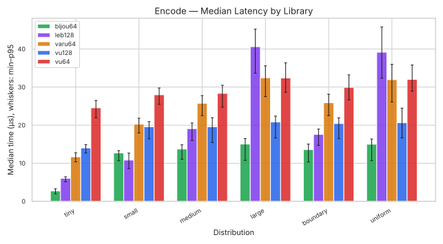
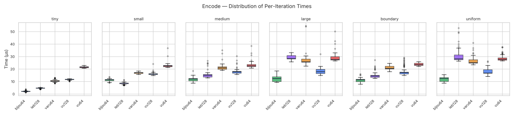


</details>

## Encode Array

Encode to a fixed `[u8; 9]` with no allocation. leb128 is excluded because its API requires a `Write` implementor.

| Distribution    | bijou64  | varu64 | vu64     | vu128 | bijou64 rank | bijou64 vs other best |
|-----------------|----------|--------|----------|-------|--------------|-----------------------|
| tiny (0-247)    | **1.05** |  6.02  | 1.63     | 1.22  | #1           | 0.86x                 |
| small (248-64k) | 3.07     |  7.04  | **1.63** | 2.12  | #3           | 1.88x                 |
| medium (64k-4B) | 3.08     |  9.18  | **1.64** | 2.51  | #3           | 1.88x                 |
| large (>4B)     | 3.06     | 15.25  | **1.66** | 2.55  | #3           | 1.84x                 |
| boundary        | 2.75     | 10.07  | **1.63** | 2.17  | #3           | 1.69x                 |
| uniform random  | 3.06     | 15.21  | **1.64** | 2.55  | #3           | 1.86x                 |

<details open>
<summary>Charts</summary>

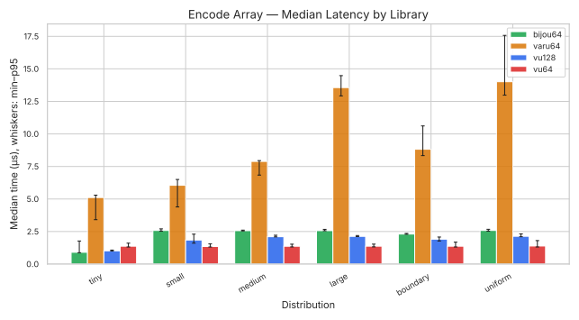
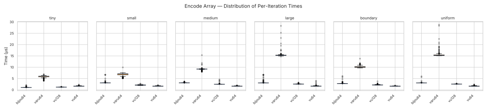

</details>

## Decode

Decode from a `&[u8]` buffer.

| Distribution    | bijou64   | varu64 | vu64  | vu128 | leb128 | bijou64 rank | bijou64 vs other best |
|-----------------|-----------|--------|-------|-------|--------|--------------|-----------------------|
| tiny (0-247)    | **2.03**  |  5.18  |  9.48 |  7.44 |  3.83  | #1           | 0.53x                 |
| small (248-64k) | **4.40**  |  8.92  | 13.95 |  9.72 |  9.71  | #1           | 0.49x                 |
| medium (64k-4B) | **4.29**  | 12.60  | 16.70 | 10.68 | 12.53  | #1           | 0.40x                 |
| large (>4B)     | **3.44**  | 20.75  |  8.52 |  7.73 | 33.88  | #1           | 0.45x                 |
| boundary        | **4.11**  | 13.67  | 12.61 |  8.35 | 10.61  | #1           | 0.49x                 |
| uniform random  | **3.39**  | 20.66  |  8.30 |  7.49 | 33.26  | #1           | 0.45x                 |

<details open>
<summary>Charts</summary>

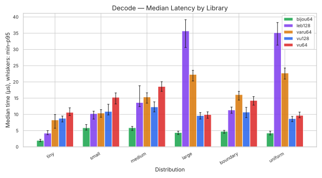
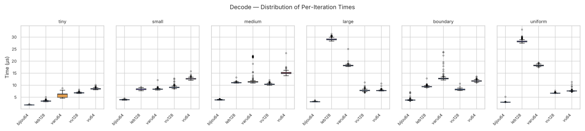
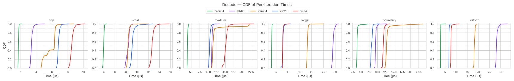

</details>

bijou64 wins every decode cell on Zen 5, with margins ranging from 1.9× (tiny vs leb128) to 2.5× (medium vs vu128). gungraun reports `decode/tiny` running in ~38 000 modelled cycles per 4096 values — fewer than every competitor on every distribution.

## Canonical Decode

Decode with a guarantee that the encoding is minimal (no overlong representations accepted). This matters for protocols that need deterministic serialisation -- if two peers can encode the same value differently, content-addressed hashes break.

bijou64 achieves canonicality structurally: its disjoint tier ranges make overlong encodings impossible, so the canonical decode path is identical to regular decode with zero overhead. varu64 and vu64 always perform a runtime minimality check (there's no way to opt out). vu128 and leb128 accept overlong encodings by design, so we wrap them with a decode-then-re-encode-and-compare-length check to simulate what a canonical-aware caller would need to do.

| Distribution    | bijou64   | varu64 | vu64  | vu128 | leb128 | bijou64 rank | bijou64 vs other best |
|-----------------|-----------|--------|-------|-------|--------|--------------|-----------------------|
| tiny (0-247)    | **2.04**  |  6.18  |  9.57 | 12.01 |  9.05  | #1           | 0.33x                 |
| small (248-64k) | **4.38**  |  8.94  | 14.05 | 17.29 | 19.76  | #1           | 0.49x                 |
| medium (64k-4B) | **4.25**  | 12.70  | 16.82 | 13.08 | 28.49  | #1           | 0.33x                 |
| large (>4B)     | **3.45**  | 20.91  |  8.48 | 10.39 | 64.23  | #1           | 0.41x                 |
| boundary        | **4.07**  | 13.84  | 12.92 | 10.24 | 26.15  | #1           | 0.40x                 |
| uniform random  | **3.38**  | 20.61  |  8.39 | 10.43 | 64.03  | #1           | 0.40x                 |

<details open>
<summary>Charts</summary>

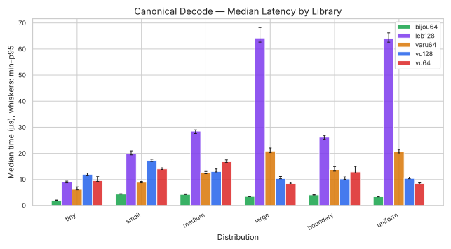
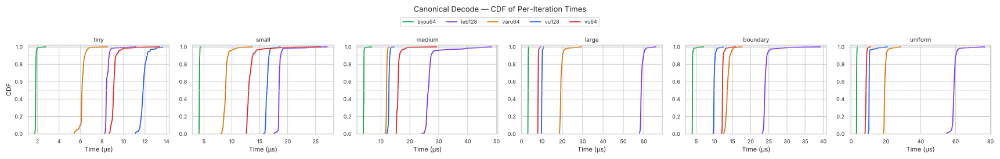

</details>

The cost of canonicality varies wildly by crate. bijou64's numbers are identical to plain decode because there's nothing extra to check. varu64 always pays its runtime check, so its column matches the plain decode table. vu128 and leb128 pay the round-trip re-encode penalty — leb128 in particular is catastrophic on large/uniform (64 µs vs 33 µs without the check) because of its byte-at-a-time `Write`/`Read` interface.

bijou64 wins all 6 canonical decode distributions on x86, including tiny — where structural canonicality edges out varu64's runtime check (2.04 µs vs 6.18 µs). For protocols that _require_ canonical encoding, this is the table that matters.

## Stream Decode

Decode a concatenated stream of encoded values. vu128 is excluded because its API requires a fixed `[u8; 9]` input.

| Distribution    | bijou64   | varu64 | vu64  | leb128 | bijou64 rank | bijou64 vs other best |
|-----------------|-----------|--------|-------|--------|--------------|-----------------------|
| tiny (0-247)    | **1.06**  |  7.05  | 11.84 |  3.71  | #1           | 0.29x                 |
| small (248-64k) | **5.23**  |  8.21  | 13.72 | 10.25  | #1           | 0.64x                 |
| medium (64k-4B) | **5.17**  | 10.38  | 15.32 | 12.35  | #1           | 0.50x                 |
| large (>4B)     | **3.26**  | 16.78  | 11.35 | 33.50  | #1           | 0.29x                 |
| boundary        | **3.66**  | 12.29  | 12.99 | 10.34  | #1           | 0.35x                 |
| uniform random  | **2.96**  | 16.85  | 11.31 | 33.42  | #1           | 0.26x                 |

<details open>
<summary>Charts</summary>

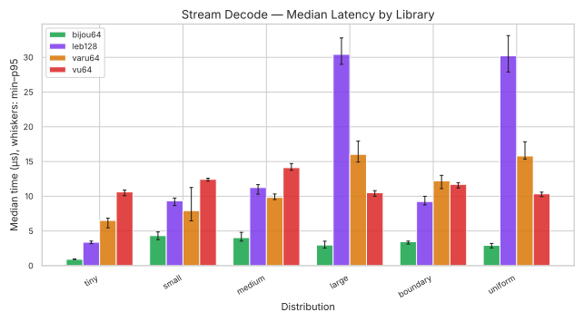


</details>

## Percentile Statistics

Full percentile breakdowns (p50/p90/p95/p99/p99.9) are available in:

- [`charts/x86/percentiles.md`](charts/x86/percentiles.md) -- markdown tables
- [`charts/x86/percentiles.csv`](charts/x86/percentiles.csv) -- machine-readable CSV
- [`charts/x86/percentiles.html`](charts/x86/percentiles.html) -- interactive sortable table

Heatmaps provide a quick visual overview of which library performs best across all distributions:

<details>
<summary>Heatmaps (click to expand)</summary>

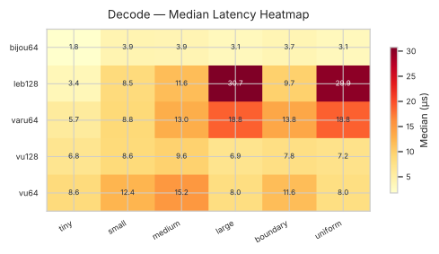
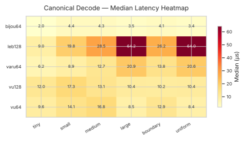
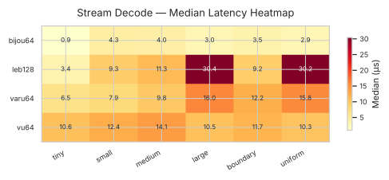


</details>

Interactive versions with hover-for-detail are in `charts/x86/*_heatmap.html`.

## Encoded Size

Bytes per value compared to a raw 8-byte `u64`. All tag-byte formats (bijou64, varu64, vu64/vu128) add 1 byte of overhead for multi-byte values. leb128 uses 1 continuation bit per byte instead.

bijou64 and varu64 share the same tag threshold (248), so their 1-byte range is wider than vu64/vu128 (0-247 vs 0-127). bijou64's per-tier offsets shift the multi-byte boundaries slightly, but the encoded sizes end up identical to varu64 at every value.

| Value    | Raw `u64` | bijou64          | varu64           | vu64 / vu128     | leb128           |
|----------|-----------|------------------|------------------|------------------|------------------|
| 0        | 8         | 1 (12.5%)        | 1 (12.5%)        | 1 (12.5%)        | 1 (12.5%)        |
| 127      | 8         | 1 (12.5%)        | 1 (12.5%)        | 1 (12.5%)        | 1 (12.5%)        |
| 128      | 8         | **1 (12.5%)** | **1 (12.5%)** | 2 (25%)          | 2 (25%)          |
| 247      | 8         | **1 (12.5%)** | **1 (12.5%)** | 2 (25%)          | 2 (25%)          |
| 248      | 8         | 2 (25%)          | 2 (25%)          | 2 (25%)          | 2 (25%)          |
| 255      | 8         | 2 (25%)          | 2 (25%)          | 2 (25%)          | 2 (25%)          |
| 256      | 8         | **2 (25%)**   | 3 (37.5%)        | **2 (25%)**   | **2 (25%)**   |
| 503      | 8         | **2 (25%)**   | 3 (37.5%)        | **2 (25%)**   | **2 (25%)**   |
| 504      | 8         | 3 (37.5%)        | 3 (37.5%)        | **2 (25%)**   | **2 (25%)**   |
| 1,000    | 8         | 3 (37.5%)        | 3 (37.5%)        | **2 (25%)**   | **2 (25%)**   |
| 16,383   | 8         | 3 (37.5%)        | 3 (37.5%)        | **2 (25%)**   | **2 (25%)**   |
| 16,384   | 8         | 3 (37.5%)        | 3 (37.5%)        | 3 (37.5%)        | 3 (37.5%)        |
| 65,535   | 8         | 3 (37.5%)        | 3 (37.5%)        | 3 (37.5%)        | 3 (37.5%)        |
| 65,536   | 8         | **3 (37.5%)** | 4 (50%)          | **3 (37.5%)** | **3 (37.5%)** |
| 66,039   | 8         | **3 (37.5%)** | 4 (50%)          | **3 (37.5%)** | **3 (37.5%)** |
| 100,000  | 8         | 4 (50%)          | 4 (50%)          | **3 (37.5%)** | **3 (37.5%)** |
| 2^24 - 1 | 8         | 4 (50%)          | 4 (50%)          | 4 (50%)          | 4 (50%)          |
| 2^32 - 1 | 8         | 5 (62.5%)        | 5 (62.5%)        | 5 (62.5%)        | 5 (62.5%)        |
| 2^40 - 1 | 8         | 6 (75%)          | 6 (75%)          | 6 (75%)          | 6 (75%)          |
| 2^48 - 1 | 8         | 7 (87.5%)        | 7 (87.5%)        | 7 (87.5%)        | 7 (87.5%)        |
| 2^56 - 1 | 8         | 8 (100%)         | 8 (100%)         | 8 (100%)         | 8 (100%)         |
| 2^64 - 1 | 8         | 9 (112.5%)       | 9 (112.5%)       | 9 (112.5%)       | 10 (125%)        |

This table is architecture-independent -- the encoded sizes are a property of the format, not the implementation.

## Summary

On Zen 5, bijou64 wins **24 of 36** shootout cells:

| Operation        | Wins |
|------------------|------|
| encode           | 5/6  |
| decode           | 6/6  |
| encode_array     | 1/6  |
| encoded_size     | 0/6  |
| stream_decode    | 6/6  |
| canonical_decode | 6/6  |

bijou64 is the fastest decoder on every distribution, in every
benchmark variant (plain decode, canonical decode, stream decode),
typically by 2–3.5× margins. Structural canonicality is free,
making bijou64 the unambiguous choice for protocols that decode
more than they encode and that need deterministic serialisation.

On the encode side, bijou64 wins 5 of 6 distributions; only `small`
goes to leb128 (1.25× faster on the 248–64k uniform range). leb128's
tight 2-byte-write loop happens to fit Zen 5's pipeline particularly
well for tier-2-heavy distributions.

The cells bijou64 loses are all format-bound:

- `encode_array` non-tiny — ~1.85× behind vu64 across all 5
  distributions. vu64's power-of-2 boundaries let it skip the per-tier
  correction step bijou64 must perform.
- `encoded_size` non-tiny — ~2.4× behind vu64. Same root cause.
- `encoded_size/tiny` — statistical tie with varu64 (1.008×).

These gaps are the price of bijective canonicality. For the
canonical-decode workloads that motivate bijou64, the trade is
overwhelmingly favourable.
